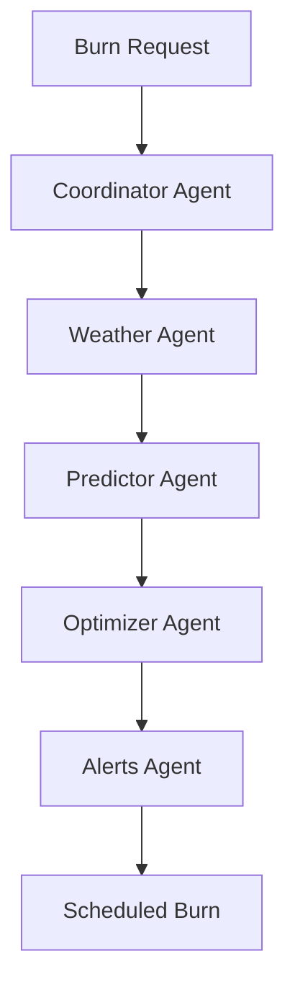

# 🏗️ Burnwise System Architecture

## Overview
Multi-farm agricultural burn coordination system using 5-agent AI workflow with TiDB vector search to prevent smoke conflicts and optimize burn schedules.

## 🔄 5-Agent Workflow Architecture



### Agent Responsibilities

#### 1. Coordinator Agent (`backend/agents/coordinator.js`)
- **Purpose**: Validate requests and orchestrate workflow
- **Key Functions**:
  - `validateBurnRequest()`: Check completeness & constraints
  - `scoreRequest()`: Priority scoring (0-100)
  - `orchestrateWorkflow()`: Manage agent pipeline
- **Dependencies**: All other agents

#### 2. Weather Agent (`backend/agents/weather.js`)
- **Purpose**: Fetch & vectorize weather data
- **Key Functions**:
  - `fetchWeatherData()`: OpenWeatherMap API integration
  - `createWeatherVector()`: 128-dimensional embedding
  - `analyzeBurnConditions()`: Safety assessment
- **Vector Dimensions**: 128 (temperature, humidity, wind, pressure...)

#### 3. Predictor Agent (`backend/agents/predictor.js`)
- **Purpose**: Model smoke dispersion using Gaussian plume
- **Key Functions**:
  - `predictSmokeDispersion()`: Gaussian plume calculation
  - `detectOverlap()`: Conflict detection
  - `calculateConcentration()`: PPM calculations
- **Algorithm**: Gaussian dispersion model with wind adjustment

#### 4. Optimizer Agent (`backend/agents/optimizer.js`)
- **Purpose**: Find optimal burn schedule
- **Key Functions**:
  - `simulatedAnnealing()`: Schedule optimization
  - `calculateEnergy()`: Cost function
  - `generateNeighbor()`: Solution exploration
- **Algorithm**: Simulated annealing with exponential cooling

#### 5. Alerts Agent (`backend/agents/alerts.js`)
- **Purpose**: Send notifications via Twilio
- **Key Functions**:
  - `sendSMS()`: Twilio SMS integration
  - `queueAlert()`: Alert scheduling
  - `trackDelivery()`: Status monitoring
- **Integration**: Twilio API for SMS

## 🗄️ Database Architecture

### TiDB Configuration
```javascript
// backend/db/connection.js
{
  host: process.env.TIDB_HOST,
  port: 4000,
  database: process.env.TIDB_DATABASE,
  connectionLimit: 10,
  enableCircuitBreaker: true,
  breakerThreshold: 5
}
```

### Vector Storage Strategy
- **Weather Vectors**: 128 dimensions (comprehensive weather state)
- **Smoke Vectors**: 64 dimensions (dispersion patterns)
- **Burn Vectors**: 32 dimensions (burn characteristics)

### Key Tables
```sql
-- Farms table
farms (
  id, name, owner_name, contact_email, 
  location, boundaries, total_acres
)

-- Burn requests table  
burn_requests (
  id, farm_id, requested_date, acres_to_burn,
  crop_type, reason, status, weather_vector,
  smoke_vector, priority_score
)

-- Weather data table
weather_data (
  id, timestamp, location, temperature,
  humidity, wind_speed, wind_direction,
  weather_vector[128]
)

-- Smoke predictions table
smoke_predictions (
  id, burn_request_id, prediction_time,
  dispersion_pattern, concentration_map,
  affected_areas, smoke_vector[64]
)
```

## 🌐 API Architecture

### RESTful Endpoints
```
POST   /api/burn-requests       - Submit new burn request
GET    /api/burn-requests       - List all requests
PUT    /api/burn-requests/:id   - Update request status

GET    /api/weather             - Current weather data
POST   /api/weather/vector      - Generate weather vector

GET    /api/schedule            - Optimized burn schedule
POST   /api/schedule/optimize   - Trigger optimization

POST   /api/alerts              - Send alert
GET    /api/alerts/status       - Check delivery status

GET    /api/farms               - List all farms
POST   /api/farms               - Register new farm

GET    /api/analytics           - System metrics
```

### WebSocket Events
```javascript
// Real-time updates
socket.emit('burn-request-updated', data)
socket.emit('weather-changed', data)
socket.emit('schedule-optimized', data)
socket.emit('alert-sent', data)
```

## 🔒 Security Architecture

### Authentication Flow
1. JWT token generation on login
2. Token validation middleware
3. Role-based access control
4. Session management

### Rate Limiting
- **Global**: 100 requests/15 minutes
- **Per-endpoint**: Custom limits
- **Circuit breaker**: 5 failures trigger

### Data Protection
- Environment variables for secrets
- SQL injection prevention (parameterized queries)
- XSS protection (input sanitization)
- CORS configuration

## 🚀 Performance Optimizations

### Caching Strategy
```javascript
// backend/db/queryCache.js
- TTL: 5 minutes for weather
- TTL: 15 minutes for schedules
- Invalidation on updates
```

### Database Optimizations
- Connection pooling (max 10)
- Prepared statements
- Index optimization
- Vector search indexing

### Frontend Optimizations
- React.memo for components
- Lazy loading routes
- WebGL for map rendering
- Service worker caching

## 🔄 Data Flow

### Burn Request Lifecycle
```
1. User submits form (Frontend)
   ↓
2. API validation (Backend)
   ↓
3. Coordinator agent processing
   ↓
4. Weather data fetching & vectorization
   ↓
5. Smoke dispersion prediction
   ↓
6. Schedule optimization
   ↓
7. Alert notifications
   ↓
8. Real-time updates via WebSocket
   ↓
9. UI updates (Frontend)
```

## 🏭 Deployment Architecture

### Development
```bash
npm run dev  # Concurrent backend (5001) + frontend (3000)
```

### Production
```bash
npm run build    # Create optimized build
npm run start    # Start production server
```

### Environment Variables
```
# Backend (.env)
TIDB_HOST
TIDB_USER
TIDB_PASSWORD
TIDB_DATABASE
OPENWEATHERMAP_API_KEY
TWILIO_ACCOUNT_SID
TWILIO_AUTH_TOKEN
JWT_SECRET

# Frontend (.env)
REACT_APP_MAPBOX_TOKEN
REACT_APP_API_URL
REACT_APP_WS_URL
```

## 📊 Monitoring & Logging

### Logging Strategy
- Winston logger configuration
- Log levels: error, warn, info, debug
- File rotation: daily
- Performance metrics tracking

### Error Handling
- Global error handler middleware
- Graceful degradation
- Circuit breaker pattern
- Retry logic with exponential backoff

## 🔧 Technology Stack

### Backend
- Node.js + Express.js
- TiDB (MySQL compatible + vector search)
- Socket.io (WebSockets)
- JWT (authentication)
- Twilio (SMS)
- OpenWeatherMap (weather data)

### Frontend
- React 18
- React Router v6
- Mapbox GL JS
- Socket.io Client
- Framer Motion (animations)
- CSS Modules

### Testing
- Jest (unit tests)
- Supertest (API tests)
- Playwright (E2E tests)
- React Testing Library

### DevOps
- ESLint + Prettier
- Husky (git hooks)
- GitHub Actions (CI/CD)
- Docker (containerization)